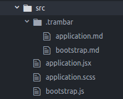

Trambar Decoration
------------------

Trambar decoration files are special Markdown text files that annotates your application's codebase from the point of view of an end user. They're used to indicate which parts of the application have changed after a push or a merge. The short descriptions are meant to give non-programmers a sense of where progress is being made. They may also guide QA efforts.

[Click here to see the Trambar project's own code decoration.](https://trambar.io/deco-demo/)

* [Decoration basics](#decoration-basics)
* [File matching](#file-matching)
* [Component icon](#component-icon)
* [Multilingual descriptions](#multilingual-descriptions)
* [Previewing decoration](#previewing-decoration)

## Decoration basics

Trambar decoration files reside in the .trambar folder alongside the targetted files:



It typically starts with a heading although this is not required.

```markdown
Foobar
------
The area of the app where a user can foo a bar.
```

## File matching

By default, a decoration file is applicable to any files with the same name (excluding extension) in the target folder and its sub-folders. E.g. `foobar.md` matches `foobar.*`. A special code section containing [.gitignore](https://git-scm.com/docs/gitignore) rules can be added to specify more sophisticated behavior:

```markdown
Foobar
------
The area of the app where a user can foo a bar.

​```​match
foo_*.js
bar_*.js
​```​
```

The default rule is not retained when a match section is present. The above example would not match `foobar.js`.

Patterns starting with `../` are acceptable--i.e. you can match files that are outside the target folder:

```markdown
Foobar
------
The area of the app where a user can foo a bar.

​```​match
foobar.js
../../widgets/foobar-input.jsx
​```​
```

This is useful when annotating a component that makes use of code from different parts of the source tree.

## Component icon

You can add an icon representing the app component:

```markdown
Foobar
------
The area of the app where a user can foo a bar.

​```​match
foobar.js
../../widgets/foobar-input.jsx
​```​

[icon]: foobar.png
```

When a filename is provided, it's assumed to be an image file in the .trambar folder. When a fully-qualified URL is given, the image would be pulled from the remote location instead.

Trambar also accepts special Font-Awesome (v.4.7) URLs:

`fa://<class name>/<background color>/<foreground color>`

## Multilingual descriptions

You can provide descriptions in multiple languages. Each description should be preceded by a line beginning with `# ` followed by a two-letter [ISO language code](https://en.wikipedia.org/wiki/List_of_ISO_639-1_codes):

```markdown
# en
Foobar
------
The area of the app where a user can foo a bar.

# pl
Fubar
-----
Strona na której użytkownik może karmić aligatora.  

​```​match
foo_*.js
bar_*.js
​```​
```

## Previewing decoration

Use [Trambar-Deco](https://github.com/chung-leong/trambar-deco) to preview
decoration files as you work on them.
