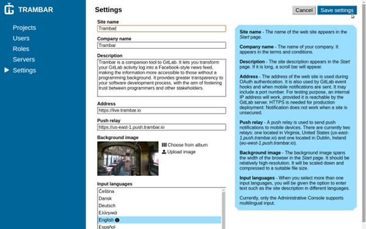
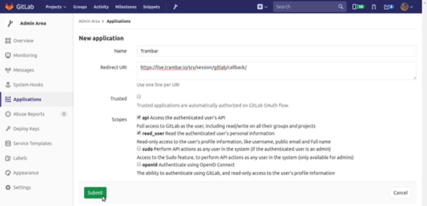
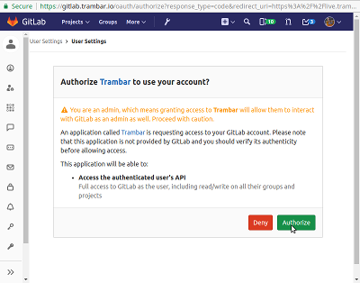

Getting Started
---------------

Trambar Server is a [Docker](https://www.docker.com/) app. Installation and
updates are managed by a [CLI utility](https://github.com/chung-leong/trambar-cli).

* [Prerequisite](#prerequisite)
* [Installation on Linux](#installation-on-linux)
* [Installation on OSX and Windows](#installation-on-osx-and-windows)
* [Setting up server](#setting-up-server)
* [Creating first project](#creating-first-project)

## Prerequisite

For production deployment, you'll see a server connected to the Internet with a
valid domain name. Trambar Server is designed to run in the Cloud. A virtual machine
with 2G of RAM and 16G of disk space should suffice, with the latter figure dependent
on the amount of expected video contents.

You also need administrative access to a GitLab server.

For evaluation on your own computer, you should create a test instance of
GitLab CE. The easiest method is with [Docker Compose](https://docs.gitlab.com/omnibus/docker/#install-gitlab-using-docker-compose).

## Installation on Linux

1. Install **npm** if it's not a default part of the Linux distro you're using.

2. Install **trambar-cli**:

   `sudo npm install -g trambar`

3. Start the installation process:

   `sudo trambar install`

4. Choose whether you wish to use SSL:

   > Set up SSL? [Y/n]

   For a production server, SSL is mandatory. Certain browser features (related
   to notification and video recording) simply do not work on an unsecured page.
   You should choose yes even if you're only evaluating the software on your own
   computer.

   If you choose yes, the installation script will ask if you wish to use
   **certbot**:

   > Use certbot (https://certbot.eff.org/)? [Y/n]

   Answer yes if you do not have an SSL certificate for the server's domain name.

   If you choose no, the script will ask if you wish to use a self-signed SSL
   certificate:

   > Use self-signed SSL certificate? [Y/n]

   Answer yes if you're evaluating the software on your computer. The use of a
   "snakeoil" certificate will lead to a browser warning, but all parts of the
   web client will function correctly. Answer no if you're employing your own
   SSL certificate.

5. Enter the server's domain name:

   > Server domain name:

6. If you have chosen to use certbot, you'll be asked to provide a contact
   e-mail address:

   > Contact e-mail:

   [Let's Encrypt](https://letsencrypt.org/) will send e-mail concerning the
   SSL certificate (e.g. expiration warning) to this address.

   Otherwise, if you have not chosen the self-signed certificate, you'll be
   prompted for the location of your SSL certificate and its private key:

   > Full path of certificate:  
   > Full path of private key:

7. Choose the HTTP port for HTTP and HTTPS:

   > HTTPS port: [443]  
   > HTTP port: [80]

8. Choose a password for the root account:

   > Password for Trambar root account:

9. Wait while the installation script install Docker and retrieve Trambar's
   images from [Docker Hub](https://hub.docker.com/u/trambar/dashboard/). The
   process should take a minute or two in a Cloud-based server with
   high-bandwidth connection to the Internet.

10. Start Trambar server:

    `sudo trambar start`

Configuration files are stored in `/etc/trambar/`. The hidden file `.env`
contains all parameters. `docker-compose.yml` contains the container
orchestration setup. It makes use of variables defined in `.env`.
Depending on choices made during installation, certain lines will be commented
out.

`.htpasswd` holds the root account password. The password is needed during
initial system setup. Once a GitLab server is paired with Trambar, you may
choose to delete this file and sign into the Administrative Console exclusively
through OAuth.

By default, the database is stored in `/srv/trambar/postgres/` while media
files are stored in `/srv/trambar/media/`. When deploying to a cloud
server, it's advisable to mount a low-cost magnetic volume at this latter
location.

## Installation on OSX and Windows

The procedures for installing Trambar on OSX and Windows are nearly the same as
doing so on Linux. You will need to install Docker manually. You do not need to
run the CLI utility with elevated privilege (i.e. no sudo).

Configuration files will be placed in a folder called "Trambar" in your home
folder. Media files and database will reside in Docker volumes. Mapping to host
folders is not done on OSX and Windows as it's not entirely reliable.

Since Docker runs in a virtual machine on OSX and Windows, you might need to
configure port-forwarding to make the server reachable from your computer.
You might also need to increase the amount of memory available to the Docker VM.

## Setting up server

1. Open a web browser and navigate to the URL of the Trambar Administrative
   Console: `https://<domain-name>/admin/`. Initial loading of the page could
   take five to ten seconds as nothing is yet cached.

2. In the sign-in page, enter *root* as the user name and the password you had
   chosen earlier. Click the **Sign in** button.

   

3. You should find yourself in the **Settings** page. If not, click **Settings**
   in the left navigation pane, then the **Edit settings** button in the
   upper-right-hand corner.

4. Enter information about your server and ensure that its web address is
   correct. Then choose a background image. It'll appear in the start page of
   the web client. Click the **Save settings** button when you're done.

   

5. Click **Servers** in the left navigation pane.

6. Click the **Add new server** button in the upper-right-hand corner.

   

7. In the *Server* page, select *GitLab* as the server type.

   

8. In a different browser tab, sign into GitLab using an account with
   administrative privilege.

9. Navigate to the **Admin area**.

   

10. Click **Applications** in the left navigation pane.

    

11. Click the **New application** button.

    

12. Enter *Trambar* as the application's name, then copy the **Redirect URI**
    from Trambar Administrative Console into the corresponding box here.
    Select **api** and **read_user** as the application's scope.

    

13. Copy the **Application id** and **Application secret** from GitLab into the
    corresponding box in Trambar Administrative Console.

    

14. Copy the URL of the GitLab server into the corresponding box in Trambar
    Adminstrative Console. The URL should contains only the domain name (and
    possibly a port number).

15. Indicate how you wish to map users from GitLab to Trambar.

    

16. Click the **Save server** button.

17. Click the **Acquire API access**.

    

18. A GitLab pop-up window will appear. Click the **Authorize** button, then
    close the window when it says *OK*.

    

At this point, **API Access** should have changed to *Administrative access
acquired*. You should also see entries in the activity log about repositories
and users imported into the system.

## Creating first project
