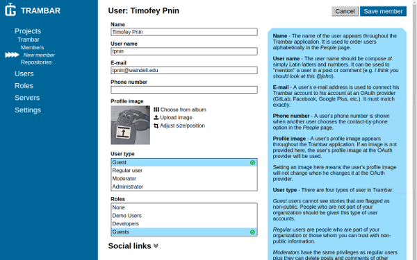

Trambar User Guide - Administrative Console
-------------------------------------------

* [Sign in](#sign-in)
* [Projects](#projects)
* [Members](#members)
* [Repositories](#repositories)
* [Users](#users)
* [Roles](#roles)
* [Servers](#servers)
* [Settings](#settings)

## Projects

* [Adding a new project](#adding-a-new-project)
* [Archiving old projects](#archiving-old-projects)
* [Deleting a project](#deleting-a-project)
* [Restoring a project](#restoring-a-project)

### Adding a new project

### Archiving old projects

### Deleting a project

### Restoring a project

## Members

* [Approving membership requests](#approving-membership-requests)
* [Rejecting membership requests](#rejecting-membership-requests)
* [Adding existing users](#adding-existing-users)
* [Adding a new member](#adding-a-new-member)
* [Removing members](#deleting-members)

### Approving membership requests

1. Click **Projects** in the left navigation pane.

   

2. Click the name of the project.

   

3. Click **Members** in the left navigation pane.

  

4. If there are unapproved requests, certain users will appear grayed out in
   the list. The **Approve all requests** button will be preselected. Click it
   to approve all requests.

   

If you wish to add only some of the users, follow the [instructions for
adding users](#adding-existing-users) instead.

### Rejecting membership requests

1. Click **Projects** in the left navigation pane.

   

2. Click the name of the project.

   

3. Click **Members** in the left navigation pane.

  

4. If there are unapproved requests, certain users will appear grayed out in
   the list. The **Approve all requests** button will be preselected. Click the
   arrow beside it, then click **Reject all requests**.

   

### Adding existing users

1. Click **Projects** in the left navigation pane.

   

2. Click the name of the project.

   

3. Click **Members** in the left navigation pane.

   

4. Click the **Edit member list** button.

   

5. The list will expand to show all users. Click the name of each user that you
   wish to add.

   

6. Click the **Save member list** button.   

   

### Adding a new member

1. Click **Projects** in the left navigation pane.

   

2. Click the name of the project.

   

3. Click **Members** in the left navigation pane.

   

4. Click the arrow beside the gray button, then **Add new member**.

   

5. Enter the new member's personal information. Select a profile image. Choose
   the user type and role.

   

6. Click the **Save member** button.

   

### Removing members

1. Click **Projects** in the left navigation pane.

   

2. Click the name of the project.

   

3. Click **Members** in the left navigation pane.

   

4. Click the **Edit member list** button.

   

5. The list will expand to show all users. Current members will be highlighted.
   Click the name of each member that you wish to remove.

   

6. Click the **Save member list** button.   

   

## Repositories

* [Adding repositories to project](adding-repositories)
* [Removing repositories](removing-repositories)

### Adding repositories to project

1. Click **Projects** in the left navigation pane.

   

2. Click the name of the project.

   

3. Click **Repositories** in the left navigation pane.

   

4. Click the **Edit role list** button.

   

5. The list will expand to show all repositories. Click the name of each repo
   you wish to associate with the project.

   

6. Click the **Save repository list** button.   

   

### Removing repositories

1. Click **Projects** in the left navigation pane.

   

2. Click the name of the project.

   

3. Click **Repositories** in the left navigation pane.

   

4. Click the **Edit role list** button.

   

   The list will expand to show all repositories.

5. Click the name of each repo you wish to remove.   

   

6. Click the **Save repository list** button.   

   

## Users

* [Adding a new user](#adding-a-new-user)
* [Deactivating users](#deactivating-a-users)
* [Deleting a user](#deleting-a-user)
* [Restoring users](#restoring-users)

### Adding a new user

### Deactivating users

### Deleting a user

### Restoring users

## Roles

* [Adding a new role](#adding-a-new-role)
* [Disabling roles](#disabling-roles)
* [Deleting a role](#deleting-a-role)
* [Assigning a role to users](#assigning-a-role-to-users)

### Adding a new role

### Disabling roles

### Deleting a role

### Assigning a role to users

## Servers

* [Adding a GitLab server](#adding-a-gitlab-server)
* [Adding Dropbox](#adding-dropbox)
* [Adding Facebook](#adding-facebook)
* [Adding GitHub](#adding-github)
* [Adding Google+](#adding-google)
* [Adding Windows Live](#adding-windows-live)

### Adding a GitLab server

### Adding Dropbox

### Adding Facebook

### Adding GitHub

### Adding Google+

### Adding Windows Live

### Disabling server

## Settings
